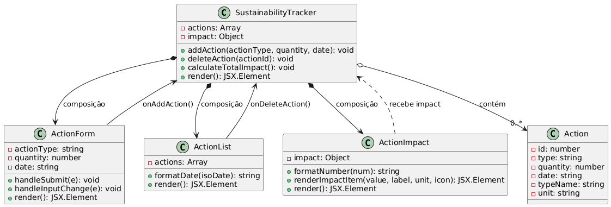

# Rastreador de Ações Sustentáveis - Diagrama UML

Este componente implementa um rastreador de ações sustentáveis que permite aos usuários registrar suas ações diárias em prol do meio ambiente e visualizar o impacto ambiental positivo que estão causando.

## Descrição dos Componentes

### SustainabilityTracker
Componente principal que gerencia o estado global das ações sustentáveis.

**Atributos**:
- `actions`: Array de objetos contendo as ações registradas
- `impact`: Objeto com métricas de impacto (água economizada, CO2 reduzido, etc.)

**Métodos**:
- `addAction(actionType, quantity, date)`: Adiciona uma nova ação
- `deleteAction(actionId)`: Remove uma ação existente
- `calculateTotalImpact()`: Calcula o impacto total de todas as ações

### ActionForm
Componente responsável pelo formulário de registro de novas ações sustentáveis.

**Atributos**:
- `actionType`: String representando o tipo de ação selecionada
- `quantity`: Número representando a quantidade da ação
- `date`: Data em que a ação foi realizada

**Métodos**:
- `handleSubmit(e)`: Processa o envio do formulário
- `handleInputChange(e)`: Atualiza o estado com as mudanças nos campos do formulário

### ActionList
Componente que exibe a lista de ações registradas pelo usuário.

**Atributos**:
- `actions`: Array de ações recebido via props do SustainabilityTracker

**Métodos**:
- `formatDate(isoDate)`: Formata a data para exibição

### ActionImpact
Componente que calcula e exibe métricas de impacto ambiental.

**Atributos**:
- `impact`: Objeto com métricas de impacto recebido via props

**Métodos**:
- `formatNumber(num)`: Formata números para exibição
- `renderImpactItem(value, label, unit, icon)`: Renderiza um item de impacto

### Action
Modelo de dados que representa uma ação sustentável.

**Atributos**:
- `id`: Identificador único da ação
- `type`: Tipo da ação (ex: WATER_SAVING)
- `quantity`: Quantidade da ação
- `date`: Data em que a ação foi realizada
- `typeName`: Nome legível do tipo da ação
- `unit`: Unidade de medida

## Relacionamentos entre Classes

- **Composição**: SustainabilityTracker contém ActionForm, ActionList e ActionImpact
- **Composição**: SustainabilityTracker contém múltiplas instâncias de Action
- **Associação**: ActionForm se comunica com SustainabilityTracker através da função onAddAction
- **Associação**: ActionList se comunica com SustainabilityTracker através da função onDeleteAction
- **Dependência**: ActionImpact depende dos dados de impacto calculados pelo SustainabilityTracker

## Diagrama de Classes UML

O diagrama abaixo mostra os relacionamentos entre os componentes React do sistema:

## Representação ASCII do Diagrama

Uma representação simplificada do diagrama em ASCII está disponível no arquivo `uml-diagram.txt`.

O diagrama ilustra os componentes principais do sistema, seus atributos, métodos e relacionamentos, seguindo a notação UML adaptada para a arquitetura de componentes React. 